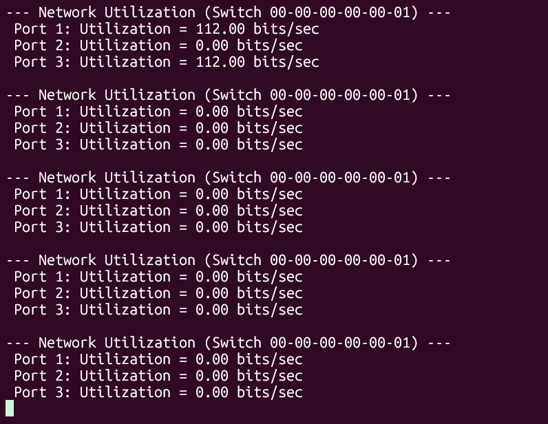
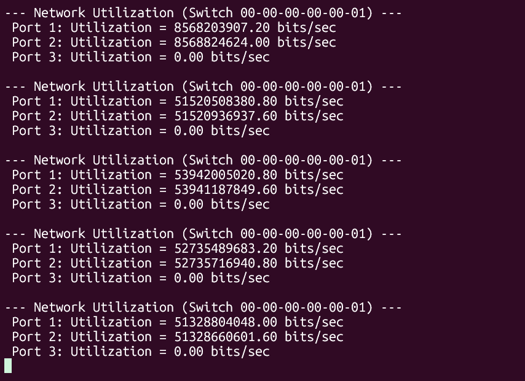
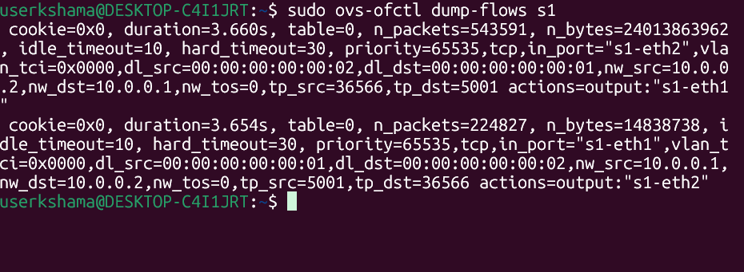

# SDN Network Utilization Monitor (Orange Problem)

## 📌 Project Overview
This project implements a real-time bandwidth monitoring system using the **POX SDN Controller** and **Mininet**. The system periodically polls the Open vSwitch (OVS) for port statistics and calculates the throughput in bits per second (bps) to provide visibility into network traffic.

## 🛠️ System Architecture
- **Controller:** POX (Python based)
- **Topology:** Single Switch (`s1`), 3 Hosts (`h1`, `h2`, `h3`)
- **Protocol:** OpenFlow 1.0


## 🧠 Monitoring Logic
The controller maintains a timer that triggers every 5 seconds:
1. It sends an `ofp_stats_request` to the switch.
2. The switch responds with an `ofp_stats_reply` containing byte counters.
3. The script calculates bandwidth using:
   $$Utilization = \frac{(CurrentBytes - PreviousBytes) \times 8}{Interval}$$

## 🚀 How to Run
1. Move `orange_monitor.py` to the `pox/ext/` directory.
2. **Terminal 1 (Controller):**
   ```bash
   python3 pox.py forwarding.l2_learning orange_monitor
3.**Terminal 2 (Mininet):**

```bash
sudo mn --topo single,3 --controller remote --mac --switch ovsk
```
Generate Traffic:

```bash
mininet> h1 iperf -s &
mininet> h2 iperf -c h1 -t 30
```
## 📊 Results & Performance

### 1. Idle Scenario
The monitor initially shows minimal background traffic (approx. 112 bps). This represents control plane overhead and ARP traffic.


### 2. High Traffic Scenario
By running `iperf` between h1 and h2, we observe a massive spike in utilization on Ports 1 and 2 (exceeding 5 Gbps), while Port 3 remains idle.


### 3. Match-Action Flow Rules
The following screenshot confirms that the controller has successfully installed flow rules in the switch. You can see the matching IP addresses (`10.0.0.1` and `10.0.0.2`) and the corresponding output actions.

